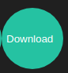

# Frontend

## First steps: 
- clone this project
- run `npm install` to install all dependencies.
- to bring up the project run the following command in the `./fwe-ss-21-759509` Directory
```bash 
sudo docker-compose up 
```
- after that you should see the page under: [http://localhost:3000](http://localhost:3000) 
## Available Scripts
In the project directory, you can run:

### `npm start`

Runs the app in the development mode.<br />
Open [http://localhost:3000](http://localhost:3000) to view it in the browser.

The page will reload if you make edits.<br />
You will also see any lint errors in the console.

### `npm run build`
Builds the app for production to the `build` folder.<br />
It correctly bundles React in production mode and optimizes the build for the best performance.

# JOKES4FWE

## Icons significations
 <strong>`Add Icon`</strong>
 <strong>`Download Icon`</strong>


## Home
On the `HOME` Page you can:
#### See a list of all the jokes


#### Add a new joke to the list


#### Update a joke


#### Delete a joke


#### Download all the Jokes as CSV-File

